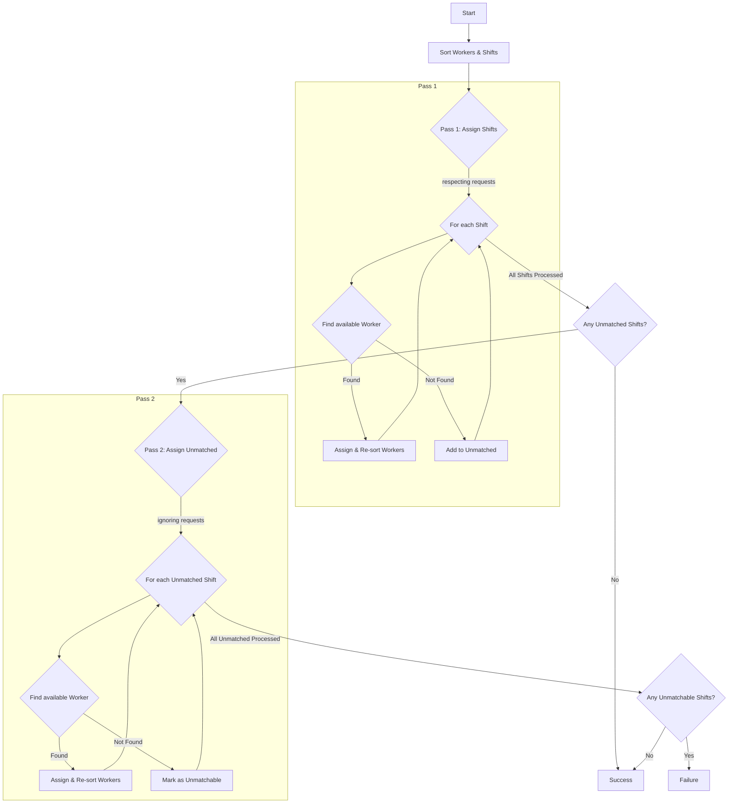

# FOSS Shift Planner

A free and open-source shift planner to manage your team's work schedule.
It is privacy-focused and runs completely locally in your browser.

## Getting Started

tbd

## Contribute

tbd

## Technical Details

The diagram below shows the general logic of the scheduling algorithm.

Given a list of following objects:

```ts
interface Shift {
  start: Date;
  duration: number;
  recoveryTime: number;
  worker: null | Worker;
}

interface Worker {
  name: string;
  hoursPerWeek: number; // Workers have a weekly hour quota.
  hourBalance: number; // Workers can start a time period with an overtime or negative hour balance.
  unavailable: OffTime[]; // Times when a worker is unavailable.
  requested: OffTime[]; // Workers can request times off
}

interface OffTime {
  from: Date;
  to: Date;
}
```

The algorithm should distribute the available workers to a defined list of shifts while balancing the workload evenly and normalizing the hour balances of all workers.
To do this, here is a first, greedy approach to the problem:

1. Sort the workers by ascending `hourBalance`
2. Sort the shifts by descending `duration` first, then by `start` time
3. Loop over the sorted lists of shifts. For every shift, match a worker with the following logic:
   1. For every `worker` in `workers`:
   2. if (worker is available respecting offtime requests)
      - add the worker to the shift
      - update the workers 'hoursBalance'
      - continue with the next shift
   3. if no worker is found for the shift, add the shift to a new list of unmatched shifts
   4. Sort the worker list again by `hourBalance`
4. if unmatched shifts remain, repeat step 3 but do not respect the requested offtimes
5. The algorithm succeeds, if no unmatched shifts remain. The algoritm is performant, when the variance of the `hourBalance` per worker is small.


