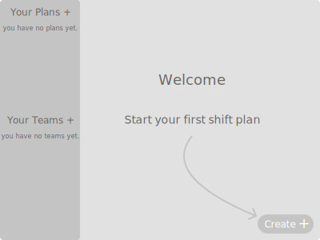
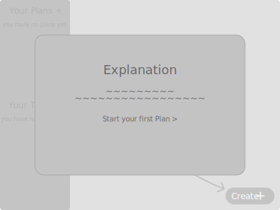
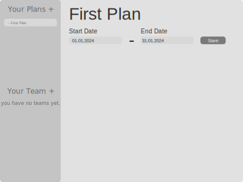
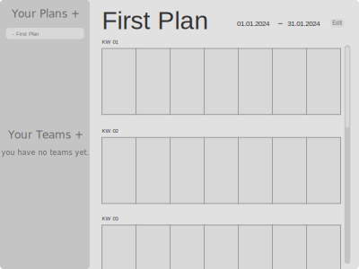
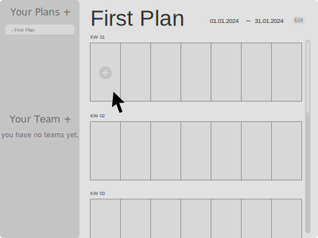
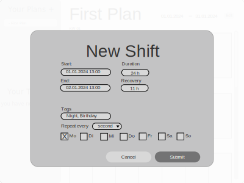
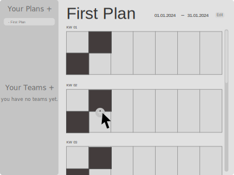
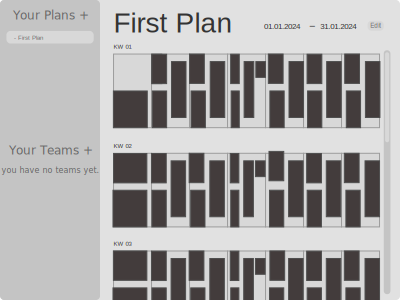

# Welcome Page

The welcome page will be displayed when the user first visits the website or if there is no local data available.

## Mockup

The first time the user opens the app, a welcome screen will be presented.
If the app finds any data in the local storage, the screen will not be displayed.

### Desktop

If the user clicks on the bottom right plus button, a modal will open explaining the general steps.

Upon clicking the action button, a first plan will be created. The user then needs to define the timerange of the shift plan.

After defining the timerange, a calendar view will be created and presented to the user.

The user can then hover over (or on mobile tap on) any day (represented as rectangles) and add a shift.

A modal will be displayed to add a shift entry. Some editing features like repetition are added for convinience.

Shifts will be displayed as calender entries in the overview. The next entry can be added just like the first.

A fully planned Calender could then look like this:

### Mobile

Mobile Views will not be displayed to save space. Not all pages will have a mobile

[Welcome Page mobile](mockups/welcome-mobile.svg)
